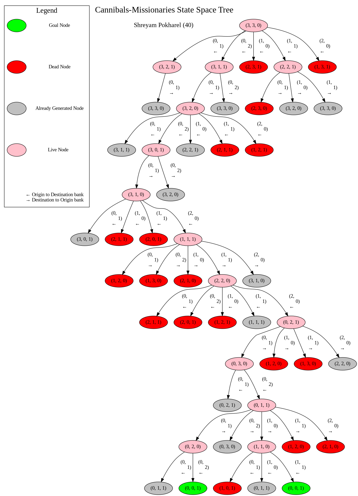

=======================================
Cannibals Missionaries State Space Tree
=======================================

Introduction
------------

The **Cannibals Missionaries problem** is a famous problem involving 3 Cannibals and 3 Missionaries, all waiting to cross the river. They are able to cross the river (from the origin bank to the destination bank) using a single boat that takes at most 2 at a time and requires at least 1 for operation. The major idea to note though is that cannibals should not outnumber missionaries at any of the river banks. If that happens, the cannibals attack the missionaries and the objective is unfulfilled. If all of the 6 manage to cross the river successfully, then the desired solution is obtained.

This problem has been implemented in the form of different games. Also, there are numerous problems devised as variations to this problem, for example Jealous Husband problem, etc.

Solution using AI
~~~~~~~~~~~~~~~~~

Artificial Intelligence (AI) has been found to be very effective in handling/solving this type of problems. The basic idea is to generate the search space tree for the problem and then perform search on the tree using any searching algorithm.

One of the best approaches for searching is Breadth First Search (BFS), where all the children of live nodes are generated before moving to the next depth level.

The solution in this repo is generated using the same (BFS) approach.

Representation of States
~~~~~~~~~~~~~~~~~~~~~~~~

The states are represented in the form [m, c, b] where *m* represents the number of missionaries in the origin bank, *c* represents the number of cannibals in the origin bank and *b* represents whether the boat is in origin bank (0) or the destination bank (1).

Note: The arrows in the edges of the `tree`_ indicate whether the move has been initiated from the origin bank to the destination bank or vice versa.

.. _tree: #state-space-tree

Getting Started
---------------

.. code-block:: bash
   :caption: Getting Started

   python3 -m venv ./venv
   source ./venv/bin/activate
   pip install -r requirements.txt

State Space Tree
----------------

   State Space Tree for Missionaries Cannibals Problem. The green node with (0, 0, 1) indicates the desired final state.
